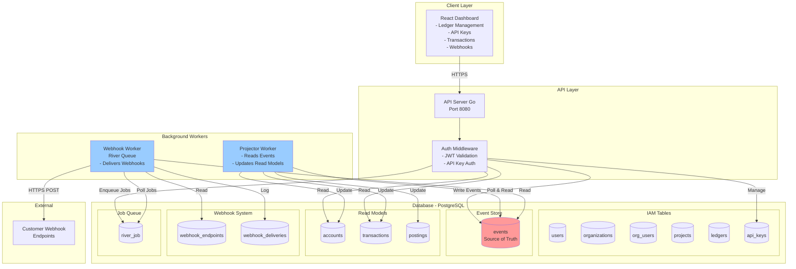

# Formance Ledger

A high-performance, multi-tenant ledger service built with Go and React. Formance Ledger provides a robust system for tracking financial transactions, managing accounts, and maintaining accurate balances with double-entry accounting principles.


## System Architecture



## Tech Stack

### Backend
- **Language:** Go (Golang) 1.22+
- **Framework:** [Fiber](https://gofiber.io/) - High performance web framework
- **Database:** PostgreSQL 16
- **ORM/Query Builder:** standard `database/sql` with [lib/pq](https://github.com/lib/pq)
- **Migrations:** [Goose](https://github.com/pressly/goose)
- **Project Structure:** Standard Go project layout (`cmd`, `internal`, `pkg`)

### Frontend
- **Framework:** React 18
- **Build Tool:** Vite
- **Language:** TypeScript
- **Styling:** Tailwind CSS
- **State Management:** React Query (TanStack Query)
- **Icons:** Lucide React
- **HTTP Client:** Axios

### Infrastructure
- **Containerization:** Docker & Docker Compose
- **Tooling:** Make (optional), Air (live reload)

## Prerequisites

- **Go:** Version 1.22 or higher
- **Node.js:** Version 18 or higher
- **PostgreSQL:** Version 16 (or use Docker)
- **Git**

## Getting Started

### 1. Clone the Repository

```bash
git clone https://github.com/tishiu/Go_FormanceLegder.git
cd Go_FormanceLegder
```

### 2. Database Setup

You can set up the database using Docker or a local PostgreSQL installation.

**Using Docker (Recommended):**

```bash
docker-compose up -d postgres
```

**Using Local PostgreSQL:**
Ensure PostgreSQL is running and create a database named `ledger_kiro`.

### 3. Backend Setup

1.  **Configure Environment Variables:**
    Copy the example environment file:
    ```bash
    cp .env.example .env
    ```
    Update `.env` with your database credentials if different from defaults.

2.  **Run Migrations:**
    ```bash
    go run cmd/migrate/main.go
    ```

3.  **Start the API Server:**
    ```bash
    # Run directly
    go run cmd/api/main.go

    # OR with Air (for live reload)
    air
    ```
    The API will be available at `http://localhost:8080`.

4.  **Start the Worker (Optional):**
    For background tasks (if applicable in future versions):
    ```bash
    go run cmd/worker/main.go
    ```

### 4. Frontend Setup

1.  **Navigate to the web directory:**
    ```bash
    cd web
    ```

2.  **Install Dependencies:**
    ```bash
    npm install
    ```

3.  **Start Development Server:**
    ```bash
    npm run dev
    ```
    The frontend will be available at `http://localhost:5173`.

## Project Structure

```
├── cmd/
│   ├── api/            # API server entry point
│   ├── migrate/        # Database migration tool
│   └── worker/         # Background worker entry point
├── internal/
│   ├── api/            # API handlers, middlewares, and routes
│   ├── config/         # Configuration loading
│   ├── core/           # Domain logic and interfaces
│   ├── database/       # Database connection and queries
│   └── service/        # Business logic services
├── migrations/         # SQL migration files
├── web/                # React frontend application
│   ├── src/
│   │   ├── api/        # API integration
│   │   ├── components/ # Reusable UI components
│   │   ├── features/   # Feature-based modules (Dashboard, Ledgers, etc.)
│   │   └── hooks/      # Custom React hooks
│   └── public/         # Static assets
└── .env                # Environment variables (gitignored)
```

## Features

- **Multi-tenancy:** Support for multiple ledgers (Books).
- **Double-Entry Accounting:** Ensures books always balance.
- **Account Management:** Create and manage asset, liability, equity, income, and expense accounts.
- **Transaction Recording:** Post complex transactions with multiple postings.
- **Real-time Dashboard:** View transaction volumes, recent activity, and system status.
- **Dark Mode:** Fully supported UI with theme toggling.
- **Responsive Design:** Optimized for desktop and mobile devices.

## Contributing

Contributions are welcome! Please feel free to submit a Pull Request.

## License

This project is licensed under the MIT License - see the LICENSE file for details.
